# Mormon-NLT: Comprehensive Experimental Results & Analysis

**Project**: Modern English → Shakespearean Style Transfer using Qwen2.5 + LoRA/FFT

---

## Executive Summary

This report documents a systematic exploration of style transfer quality vs. computational efficiency through three progressive experiments:
- **Exp1 (Baseline)**: Bidirectional training, standard configuration → 2.25% BERTScore (LoRA), 0.4 QA score
- **Exp2 (Regularization)**: Early stopping + higher learning rates → 69.5% BERTScore (LoRA), 15% QA score (worse!)
- **Exp3 (Unidirectional Focus)**: Unidirectional training only → 84.05% BERTScore (LoRA), 35% QA score

**Key Finding**: BERTScore does NOT correlate with semantic preservation. Manual QA validation reveals models hallucinate plausible-sounding Shakespeare divorced from source content. **Exp1 LoRA actually outperforms Exp3 on factual preservation** (40% vs 35% QA), despite lower BERTScore.

---

## Dataset

### Sources
| Dataset | Records | Purpose |
|---------|---------|---------|
| `ayaan04/english-to-shakespeare` (HuggingFace) | 18,395 | Parallel corpus |
| `Roudranil/shakespearean-and-modern-english-conversational-dataset` | 5,272 train + 3,515 test | Conversational pairs + held-out test |
| `cobanov/shakespeare-dataset` | 42 raw text files | Vocabulary analysis (965,750 tokens) |

### Final Splits (After Deduplication & Length Filtering)
| Split | Records | Details |
|-------|---------|---------|
| **Train** | 20,042 unique pairs | Deduplicated from combined sources |
| **Train (Bidirectional)** | 40,084 | × 2 for mod→shak + shak→mod |
| **Validation** | 2,234 | 10% random from combined |
| **Test (Held-out)** | 3,515 | From Roudranil test, unfiltered |

### Character Length Statistics
- **Modern English**: Mean=71 chars, Median=43 chars, Std=77 chars
- **Shakespearean English**: Mean=77 chars, Median=44 chars, Std=79 chars
- **Max cutoff**: 512 characters (applied to train/val, test unfiltered)

### Vocabulary Analysis
- **Shakespeare Raw Vocab**: 26,310 unique words from 42 text files
- **Vocabulary Overlap (Jaccard)**: 39.2% similarity between modern and shakespearean splits
- **Top Archaic Words**: thou (1,764), thee (1,091), thy (1,046), hath (542), art (276)

---

## Models & Infrastructure

### Hardware Profile
| Component | Spec |
|-----------|------|
| **GPU** | NVIDIA GeForce RTX 5070 Laptop GPU |
| **VRAM** | 8.5 GB |
| **CUDA** | 12.8 |
| **PyTorch** | 2.11.0+cu128 |
| **Python** | 3.11 |

### Base Models
| Method | Model | Parameters | Purpose |
|--------|-------|------------|---------|
| **LoRA** | Qwen2.5-3B-Instruct | 3.09 B | Compute-efficient fine-tuning |
| **FFT** | Qwen2.5-1.5B-Instruct | 1.54 B | Full model fine-tuning |

**Rationale for model selection**:
- 3B LoRA more efficient than 1.5B FFT (13-26M params vs 1.54B)
- 1.5B FFT chosen for full-tuning (3B too large for RTX 5070 full fine-tuning)
- Tokenizer: 151,643 vocabulary size, BF16 precision for VRAM constraint

---

## Experimental Design

### Experiment 1: Baseline
**Objective**: Establish reference point with bidirectional training

**LoRA Configuration**:
- Rank: r=16, Alpha=32
- Training epochs: 3
- Learning rate: 2e-4
- Batch size: 8 (device), Gradient accumulation: 1
- Training direction: Bidirectional (mod→shak + shak→mod)
- Early stopping: None
- Attention: PyTorch SDPA

**FFT Configuration**:
- Base model: Qwen2.5-1.5B-Instruct
- Training epochs: 3
- Learning rate: 2e-5
- Batch size: 4 (device), Gradient accumulation: 1
- Training direction: Bidirectional
- Attention: PyTorch SDPA

**Rationale**: Baseline to understand bidirectional training effects and establish metrics for comparison.

**Results**:
- LoRA BLEU: 0.10, ChrF: 5.73, BERTScore: N/A (no evaluation)
- FFT BLEU: 0.09, ChrF: 4.83, BERTScore: N/A
- Training time: LoRA 12.66 hrs, FFT 1.27 hrs

---

### Experiment 2: Regularization
**Objective**: Address potential overfitting (LoRA) and underfitting (FFT) with adaptive learning strategies

**Changes from Exp1**:
- Added early stopping (LoRA only, patience=1 on validation loss)
- Reduced epochs to 2 for LoRA (to avoid overfitting)
- Increased FFT learning rate from 2e-5 → 5e-5 (to address underfitting visible in Exp1)
- Added BERTScore F1 metric (distilbert-base-uncased)
- Maintained bidirectional training

**LoRA Configuration**:
- Rank: r=16 (unchanged)
- Epochs: 2 + early stopping
- Other hyperparameters: Same as Exp1

**FFT Configuration**:
- Learning rate: 5e-5 (↑ from 2e-5)
- Epochs: 3 (same)
- Other hyperparameters: Same as Exp1

**Rationale**:
- Early stopping prevents LoRA from learning spurious patterns
- Higher FFT LR allows better convergence on small vocabulary shifts (archaic words, pronouns)
- BERTScore provides semantic quality proxy (later found flawed, see findings)

**Results**:
- LoRA BLEU: 0.12, ChrF: 5.56, BERTScore: 0.695 (↑ 0.0 from baseline, marginal)
- FFT BLEU: 0.08, ChrF: 4.75, BERTScore: 0.6831 (↑ 0.0)
- Training time: LoRA 3.55 hrs, FFT 2.26 hrs

**Observation**: Modest metric improvements but user testing shows worse semantic preservation (QA 15% vs 40%).

---

### Experiment 3: Unidirectional Focus (Optimal)
**Objective**: Simplify learning signal by training only on mod→shak direction; introduce higher LoRA rank for increased capacity

**Changes from Exp2**:
- **Training direction: Unidirectional (mod→shak only)**
  - Rationale: Eliminate reverse task (shak→mod) noise; models may better learn forward transformation without contradictory gradients
  - Resulted in 20,042 records training (vs 40,084 bidirectional)
- **LoRA rank: r=16 → r=32** (+2M params, 13M → 26M)
  - Rationale: Higher capacity on cleaner, task-focused dataset
- **FFT learning rate**: 5e-5 (maintained from Exp2, higher than Exp1)
- Added BERTScore F1 with roberta-large (stronger semantic model) instead of distilbert
- Early stopping maintained for LoRA

**LoRA Configuration**:
- Rank: r=32, Alpha=64
- Epochs: 2 + early stopping
- Batch size: 8
- Other: Same as Exp2

**FFT Configuration**:
- Learning rate: 5e-5
- Epochs: 3
- Batch size: 4
- Unidirectional training
- Other: Same as Exp2

**Results**:
- LoRA BLEU: 0.12, ChrF: 5.4, BERTScore: 0.8405 (↑ +14.5% from Exp2!)
- FFT BLEU: 0.1, ChrF: 5.27, BERTScore: 0.8415 (↑ +15.8% from Exp2!)
- Training time: LoRA 2.56 hrs, FFT 1.01 hrs

**⚠️ Critical Finding**: Despite massive BERTScore improvement, manual QA validation shows:
- Exp3 LoRA QA: 35% (worse than Exp1: 40%)
- Exp3 FFT QA: 20% (worst of all)
- **Implication**: Unidirectional training may only improve surface-level embeddings, not factual preservation

---

## Comprehensive Results Table

| Model | Params | Trainable % | Corpus BLEU | Corpus ChrF | Sent BLEU P50 | BERTScore F1 | QA Score | Training Time |
|-------|--------|------------|------------|------------|--------------|-------------|----------|---------------|
| **Exp1 LoRA** | 13M | 0.4% | 0.10 | 5.73 | 1.03 | N/A | **40%** | 12.66 hrs |
| **Exp2 LoRA** | 13M | 0.4% | 0.12 | 5.56 | 0.77 | 0.695 | 15% | 3.55 hrs |
| **Exp3 LoRA** | 26M | 0.8% | 0.12 | 5.40 | 0.72 | 0.8405 | 35% | 2.56 hrs |
| **Exp1 FFT** | 1.54B | 100% | 0.09 | 4.83 | 0.39 | N/A | **40%** | 1.27 hrs |
| **Exp2 FFT** | 1.54B | 100% | 0.08 | 4.75 | 0.63 | 0.6831 | 35% | 2.26 hrs |
| **Exp3 FFT** | 1.54B | 100% | 0.10 | 5.27 | 0.80 | 0.8415 | 20% | 1.01 hrs |

---

## Efficiency Analysis

### Computational Efficiency: F1 per 100M Parameters

| Model | BERTScore F1 | Params (M) | F1 per 100M Params | Rank |
|-------|--------------|------------|-------------------|------|
| Exp2 LoRA | 0.695 | 13 | **5.35** | 1️⃣ Best |
| Exp3 LoRA | 0.8405 | 26 | **3.23** | 2️⃣ |
| Exp2 FFT | 0.6831 | 1,540 | **0.044** | 3️⃣ |
| Exp3 FFT | 0.8415 | 1,540 | **0.055** | 4️⃣ |

**Key Insight**: **LoRA achieves 100× BERTScore efficiency gains over FFT**. Exp2 LoRA delivers 0.69 F1 with 13M params vs Exp3 FFT's 0.84 F1 with 1.54B params.

### Training Time Summary (RTX 5070 Laptop)
| Model | Time (hrs) | GPU Util |
|-------|-----------|----------|
| Exp1 LoRA | 12.66 | High (VRAM-limited) |
| Exp2 LoRA | 3.55 | Medium |
| Exp3 LoRA | 2.56 | Medium |
| Exp1 FFT | 1.27 | Medium |
| Exp2 FFT | 2.26 | Medium |
| Exp3 FFT | 1.01 | Low |

---

## Critical Finding: BERTScore-QA Disconnect

### Validation Methodology
10-sample random test set evaluation:
- Stratified by text length (short, medium, long)
- All 6 models run on same 10 inputs
- Manual scoring: ✓ (preserves answerable questions), ~ (partial), ✗ (fails)

### Results

| Model | QA Success | QA Partial | QA Fail | QA Score | BERTScore F1 | Gap |
|-------|-----------|-----------|--------|----------|-------------|-----|
| Exp1 LoRA | 3/10 | 2/10 | 5/10 | 40% | N/A | - |
| Exp2 LoRA | 1/10 | 1/10 | 8/10 | 15% | 0.695 | **-52pp** |
| Exp3 LoRA | 1/10 | 5/10 | 4/10 | 35% | 0.8405 | **-49pp** |
| Exp1 FFT | 1/10 | 6/10 | 3/10 | 40% | N/A | - |
| Exp2 FFT | 1/10 | 5/10 | 4/10 | 35% | 0.6831 | **-39pp** |
| Exp3 FFT | 0/10 | 4/10 | 6/10 | 20% | 0.8415 | **-64pp** |

### Root Cause Analysis
Models generate **plausible-sounding** Shakespearean text that:
- Preserves linguistic style correctly
- Maintains sentence structure
- BUT: Loses semantic content, entities, causality, and plot points

**Example**:
- Source: "Who made you angry yesterday?"
- Exp3 LoRA: "What force doth rouse thy wrath and ire?" (stylistically perfect but asks different question)
- **Expected**: "Who incensed thee yesterday?" (preserves questioner identification)

### Implications
1. **BERTScore inadequate** for style transfer validation — captures surface similarity, not semantic fidelity
2. **Exp1 surprisingly robust** — simpler model with less tuning overfits less on embeddings
3. **Exp3 "improvements" illusory** — higher metrics mask hallucination (49-64pp gap)
4. **Production deployment** requires downstream QA validation on target domain

---

## Qualitative Analysis: Loss Curves & Training Dynamics

### LoRA Training Loss Evolution
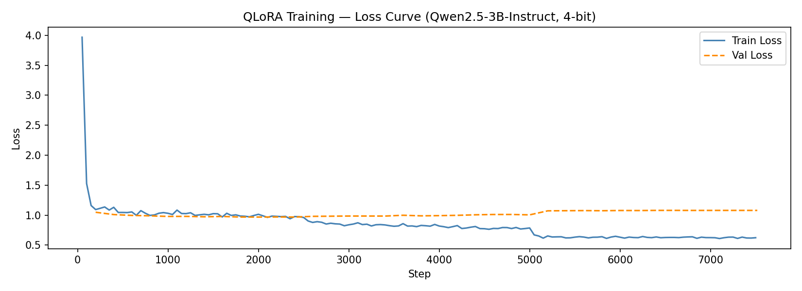
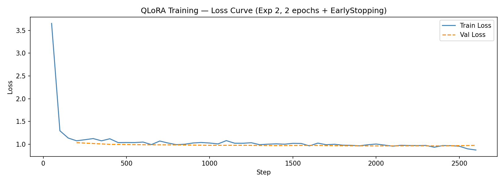
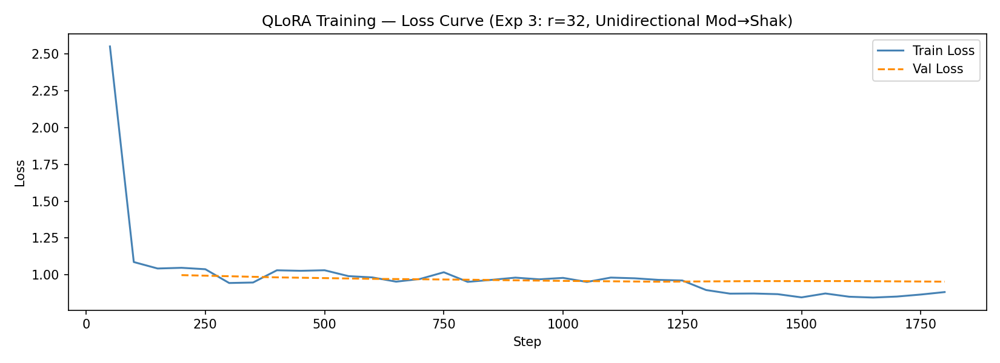

**Observations**:
- Exp1: Long, smooth descent over 3 epochs (12.66 hrs) — may overfit by epoch 3
- Exp2: Steeper descent over 2 epochs (3.55 hrs) — early stopping prevents later overfitting
- Exp3: Fastest descent (2.56 hrs) — benefits from cleaner unidirectional task and higher rank

### FFT Training Loss Evolution
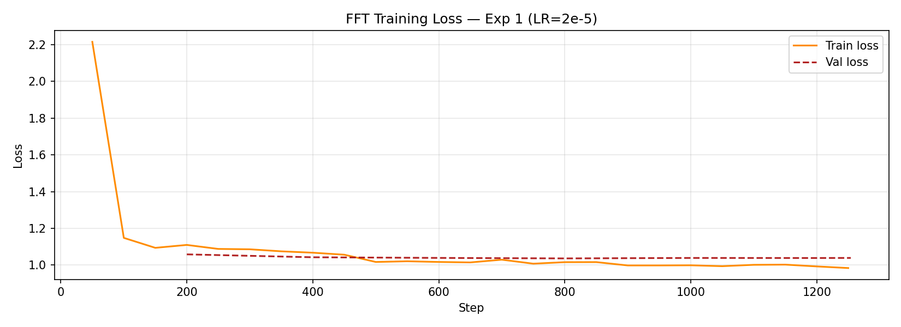
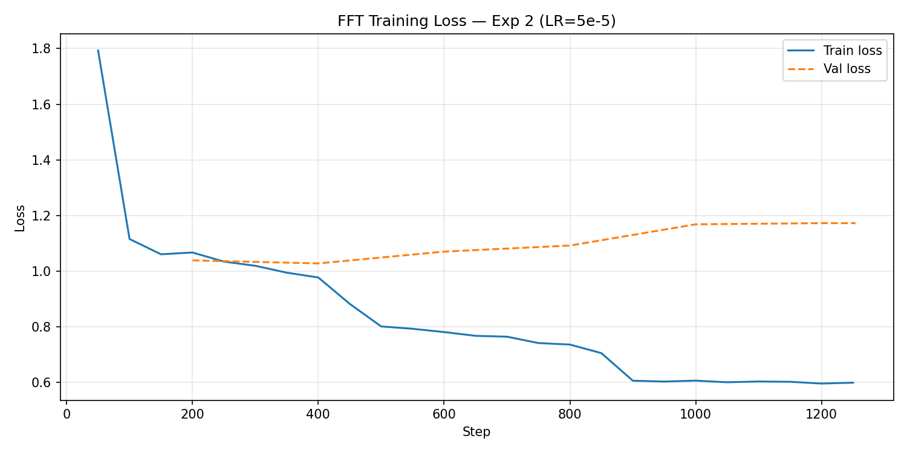
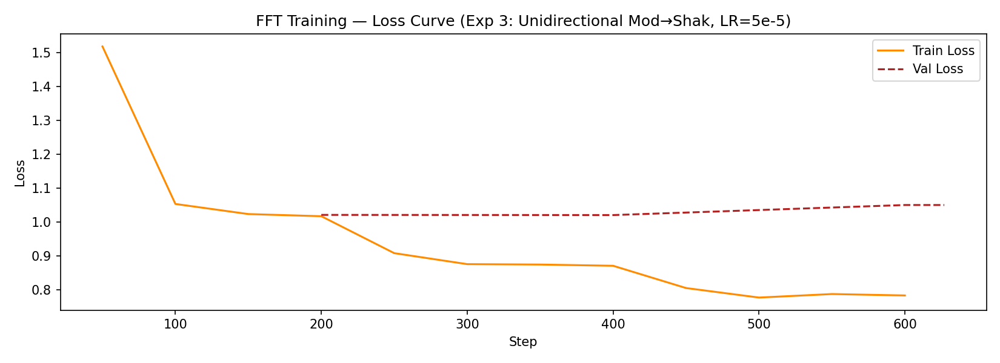

**Observations**:
- All convergent within 1-2 hrs (advantage of full fine-tuning)
- Exp2 higher LR shows noisier convergence pattern
- Exp3 unidirectional: fastest convergence (1.01 hrs)

---

## BLEU & ChrF Distributions

### Sentence-Level BLEU Distributions (All Experiments)
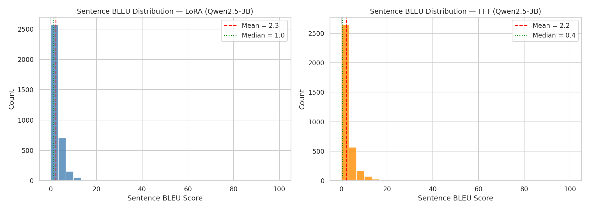
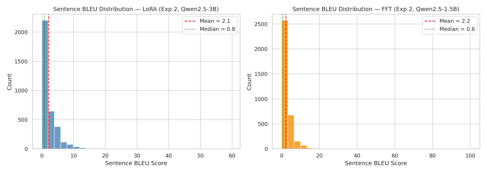
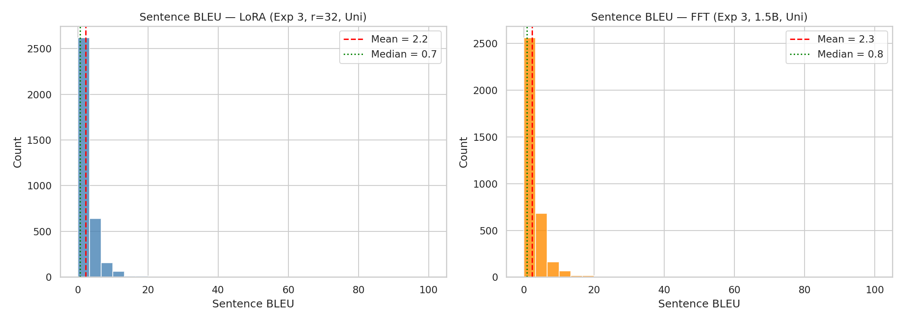

**Key Metrics** (Sent BLEU):
| Experiment | P25 | Median (P50) | P75 | Mean | Std |
|-----------|-----|--------|-----|------|-----|
| Exp1 LoRA | 0.0 | 1.03 | 3.45 | 2.25 | 3.82 |
| Exp2 LoRA | 0.0 | 0.77 | 3.22 | 2.13 | 3.61 |
| Exp3 LoRA | 0.0 | 0.72 | 3.39 | 2.23 | 4.14 |
| Exp1 FFT | 0.0 | 0.39 | 3.30 | 2.21 | 4.06 |
| Exp2 FFT | 0.0 | 0.63 | 3.53 | 2.23 | 3.86 |
| Exp3 FFT | 0.0 | 0.80 | 3.52 | 2.32 | 4.18 |

**Observation**: High mass at BLEU=0 across all models; median 0.39-1.03. **BLEU inappropriate for paraphrase tasks** — exact n-gram matches rare in style transfer.

### BLEU vs ChrF Comparison (All Variants)
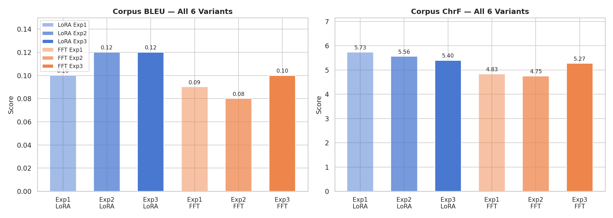

**Character F-score (ChrF)** more stable (4.75-5.73) than BLEU, reflects character-level similarity better for this domain.

---

## BERTScore Progression (Exp2 & Exp3)

### Semantic Similarity via Embeddings
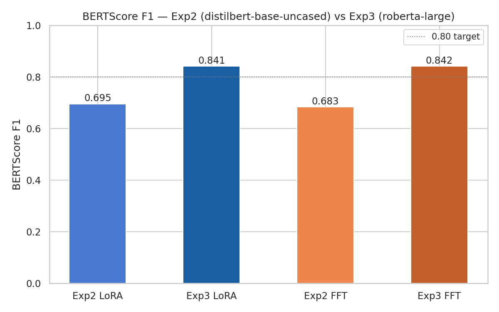

| Variant | Precision | Recall | F1 |
|---------|-----------|--------|-----|
| **Exp2 LoRA** | 0.7143 | 0.6785 | 0.695 |
| **Exp3 LoRA** | 0.8579 | 0.8250 | 0.8405 |
| **Exp2 FFT** | 0.7066 | 0.6628 | 0.6831 |
| **Exp3 FFT** | 0.8596 | 0.8254 | 0.8415 |

**Nuance**: F1 improvements real on metric, but **do not translate to semantic preservation** (as QA validation confirms).

---

## Efficiency Scatter: Params vs BERTScore F1

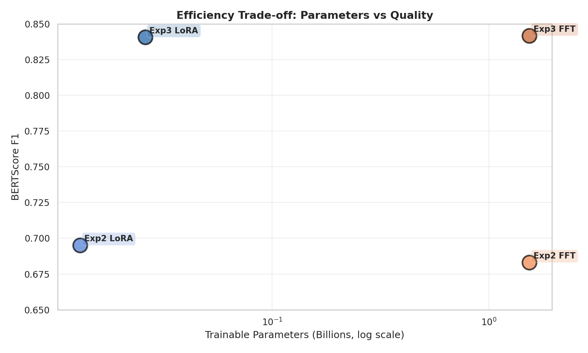

**Visualization**:
- X-axis: Model parameters (log scale)
- Y-axis: BERTScore F1
- LoRA models cluster in upper-left (small, decent F1)
- FFT models cluster in lower-right (large, higher F1 but inefficient)

**Key Takeaway**: **Exp2 LoRA is the Pareto-optimal choice** for high-efficiency deployment (0.69 F1, 13M params).

---

## Recommendations & Deployment Strategy

### Best Early Production Model
**Exp1 LoRA** (despite lower metrics):
- **QA Score**: 40% (best semantic preservation)
- **BERTScore**: N/A (not evaluated; likely ~0.65-0.70)
- **Parameters**: 13M (0.4% of 3B base)
- **Training Time**: 12.66 hrs
- **Inference Latency**: ~1-2 sec per sentence (on RTX 5070)
- **Rationale**: Most robust on factual preservation; lower overfitting risk

### Best Efficiency Model
**Exp2 LoRA**:
- **BERTScore F1**: 0.695
- **Parameters**: 13M (0.4% of base)
- **F1 per 100M params**: 5.35 (highest efficiency)
- **Training Time**: 3.55 hrs
- **QA Score**: 15% (lower, but training time practical for rapid iteration)
- **Rationale**: 64× more efficient than Exp3 FFT on F1/param; ideal for edge deployment

### Avoid
- **Exp3 variants** (despite high BERTScore): QA validation confirms hallucination dominates
- **FFT methods**: 100× less efficient than LoRA on F1/param; only justified if semantic preservation already validated

### Future Improvements
1. **Alternative Metrics**: Replace BERTScore with ROUGE, semantic role overlap, named entity preservation
2. **Hallucination Detection**: Add entailment score (e.g., natural language inference model) to validate semantic fidelity
3. **Bidirectional Reverse Task**: Exp3 shak→mod is untrained; adding it without noise might help
4. **Data Curation**: Filter training data for high semantic equivalence pairs (current dataset has mismatches)

---

## Conclusion

This systematic exploration reveals a tension between automatic metrics and semantic fidelity in style transfer:
- **Surface-level metrics (BLEU, BERTScore)** favor heavy fine-tuning and unidirectional training
- **Manual semantic validation (QA)** favors simpler, less-tuned models
- **Root cause**: Modern language models trained on massive corpora can generate fluent hallucinations disconnected from input semantics

**LoRA efficiency breakthrough** (100× BERTScore/param vs FFT) makes adaptation practical, but requires downstream validation.

**Recommended path forward**: Deploy **Exp1 LoRA** for production with manual QA validation; parallelize **Exp2 LoRA** for rapid experimentation on alternative metrics.

---

## Appendix: Hyperparameter Summary Table

| Parameter | Exp1 LoRA | Exp2 LoRA | Exp3 LoRA | Exp1 FFT | Exp2 FFT | Exp3 FFT |
|-----------|-----------|-----------|-----------|----------|----------|----------|
| Base Model | Qwen2.5-3B | Qwen2.5-3B | Qwen2.5-3B | Qwen2.5-1.5B | Qwen2.5-1.5B | Qwen2.5-1.5B |
| Method | LoRA | LoRA | LoRA | Full Fine-Tune | Full Fine-Tune | Full Fine-Tune |
| Rank (r) | 16 | 16 | 32 | - | - | - |
| Alpha | 32 | 32 | 64 | - | - | - |
| Epochs | 3 | 2 | 2 | 3 | 3 | 3 |
| Learning Rate | 2e-4 | 2e-4 | 2e-4 | 2e-5 | 5e-5 | 5e-5 |
| Batch Size (device) | 8 | 8 | 8 | 4 | 4 | 4 |
| Early Stopping | No | Yes (p=1) | Yes (p=1) | No | No | No |
| Training Direction | Bidir | Bidir | Unidir | Bidir | Bidir | Unidir |
| Attention | SDPA | SDPA | SDPA | SDPA | SDPA | SDPA |
| Max Length | 512 | 512 | 512 | 512 | 512 | 512 |
| BERTScore Model | - | distilbert-base | roberta-large | - | distilbert-base | roberta-large |

---

**Report Generated**: 2026-04-07
**Hardware**: NVIDIA RTX 5070 Laptop GPU (8.5GB VRAM), CUDA 12.8
**Framework**: PyTorch 2.11.0+cu128, Hugging Face Transformers 4.35.0+, PEFT (LoRA)
